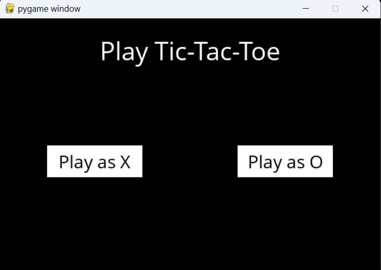
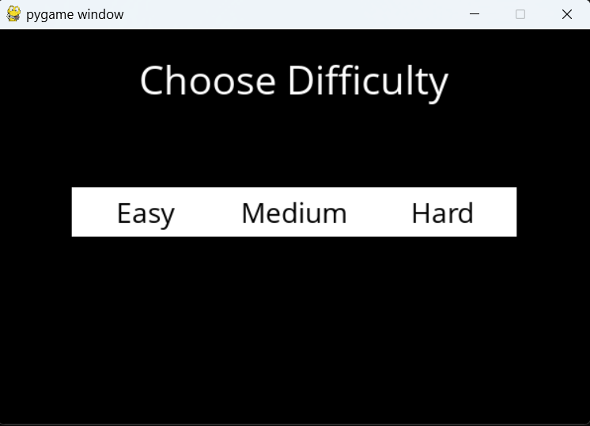
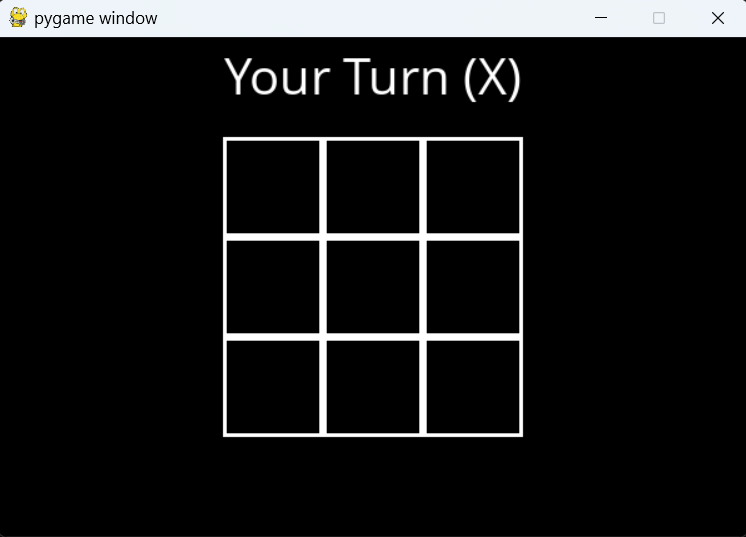
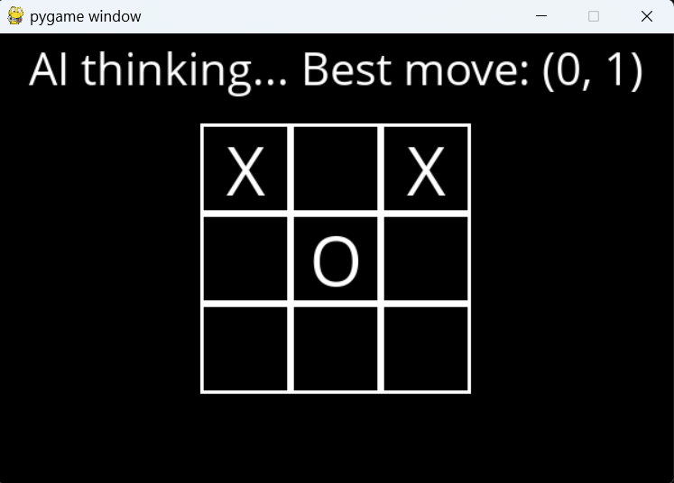
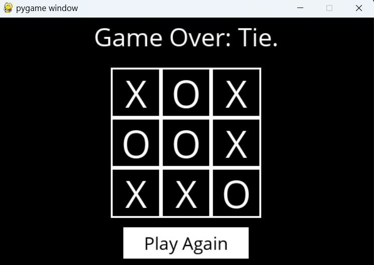

# Tic Tac Toe AI using Minimax Algorithm

An Artificial Intelligence powered Tic Tac Toe game implemented in Python using the Minimax algorithm.
The AI analyzes possible game states and selects the best move based on the chosen difficulty level.

This project demonstrates how game theory and adversarial search can be used to build intelligent decision-making systems.

---
## Project Link

[Explore the Tic Tac Toe AI Repository](https://github.com/Ghanashyam-bit-beep/tic-tac-toe-ai)

## Features

* Human vs AI gameplay
* Multiple AI difficulty levels
* AI powered by the Minimax algorithm
* Strategic decision making
* Clean and modular Python implementation
* Demonstrates adversarial search in game AI

---

## Difficulty Levels

The game includes three AI difficulty levels:

 Easy

* AI selects random moves.
* Suitable for beginners.

 Medium

* AI combines random moves with strategic decisions.

 Hard

* AI uses the Minimax algorithm to compute the optimal move.
* Very difficult to beat.

---

## Technologies Used

* Python
* Game Theory
* Minimax Algorithm
* Recursive Search

---

## How the AI Works

The AI uses the Minimax algorithm, a recursive decision-making algorithm used in two-player games.

The algorithm evaluates every possible game state and assigns scores:

* +1 → AI wins
* -1 → Human wins
*  0 → Draw

The AI then chooses the move that maximizes its chances of winning while minimizing the opponent’s chances.

---

## Project Structure

```
tic-tac-toe-ai/
│
├── runner.py        # Handles game execution and interface
├── tictactoe.py     # Contains AI logic and Minimax implementation
├── requirements.txt # Python dependencies
├── README.md
└── docs/
    ├── screenshot1.png
    ├── screenshot2.png
    ├── screenshot3.png
    ├── screenshot4.png
    └── screenshot5.png
```

---

## Installation

Clone the repository

```
git clone https://github.com/Ghanashyam-bit-beep/tic-tac-toe-ai.git
```

Navigate to the project directory

```
cd tic-tac-toe-ai
```

Install dependencies

```
pip install -r requirements.txt
```

Run the game

```
python runner.py
```
---

## Gameplay Screenshots

<p align="center">
  
  
</p>

<p align="center">
  
  
</p>

<p align="center">
  
</p>

---

## Algorithm Complexity

The Minimax algorithm explores the game tree with time complexity:

O(b^d)

Where:

* b = branching factor (possible moves)
* d = depth of the game tree

Since Tic Tac Toe has a limited board size, the algorithm can evaluate all possible game states efficiently.

---

## Learning Outcomes

Through this project:

* Implemented the Minimax algorithm
* Explored adversarial search techniques
* Applied game theory concepts
* Built an AI agent capable of optimal decision making
